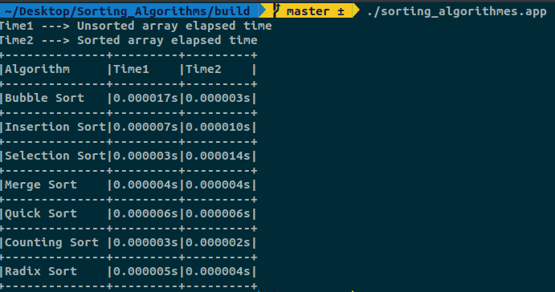
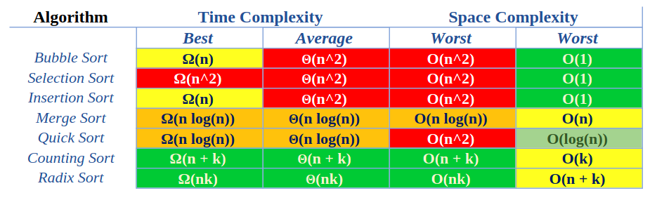

# Array sorting algorithms comparison
Comparison of the runtime of array sorting algorithms :card_file_box:


Array is one of the most popular data structures. One of the operations that can be operate on the array is the sort operation. The important point is that not all algorithms are optimal, and some algorithms may perform better than others. So it is important to know which algorithms are optimal and perform better.

Here we have examined the following sorting algorithms:
- Bubble Sort
- Selection Sort
- Insertion Sort
- Merge Sort
- Quick Sort
- Counting Sort
- Radix Sort



> **Note:** Comparing the elapsed time for each algorithm is not the right way to compare sorting algorithms and can only be useful to find an vision of the performance of algorithms.

In computer science, we use **Time Complexity** and **Space Complexity** to compare the performance of different algorithms.
Time Complexity and Space Complexity for the above algorithms are as follows:



# Requirements
- CMake
- Makefile
- C++ Compiler (GCC is recommended)

```
cmake . -B build
```
After the MakeFile was created:
```
make -C build
```
# Contributing
Your contributions are always welcome!
